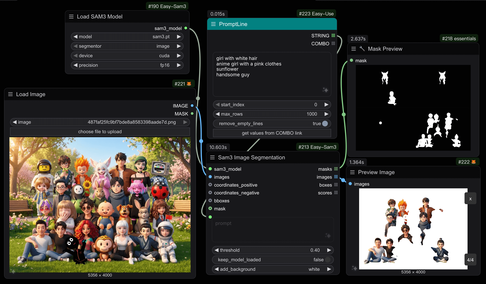
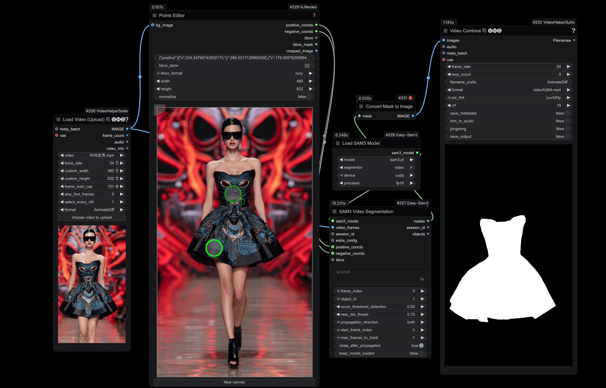

# ComfyUI-Easy-Sam3

[English](README.md) | [中文](README_CN.md)

A ComfyUI custom node package for [SAM3 (Segment Anything Model 3)](https://github.com/facebookresearch/sam3), providing powerful image and video segmentation capabilities with text prompts.

## Overview

This node package brings Meta's SAM3 model to ComfyUI, enabling:
- **Image Segmentation**: Segment objects in images using text descriptions
- **Video Tracking**: Track and segment objects across video frames
- **Advanced Configuration**: Fine-tune video tracking parameters for optimal results

### Image Segmentation

*Example of semantic segmentation on images*

### Video Segmentation

*Example of points coordinates segmentation on video frames*

## Features

- 🖼️ **Image Segmentation**: Segment objects using natural language prompts
- 🎬 **Video Segmentation**: Track objects across video frames with consistent IDs
- 🎨 **Background Options**: Add custom backgrounds (black, white, grey) to segmented images
- ⚙️ **Flexible Configuration**: Support for different devices (CUDA, CPU, MPS) and precisions (fp32, fp16, bf16)
- 🔧 **Advanced Controls**: Comprehensive video tracking parameters for fine-tuning

## Nodes

### 1. Load SAM3 Model
Load a SAM3 model for image or video segmentation.

**Inputs:**
- `model`: SAM3 model file from the models/sam3 folder
- `segmentor`: Choose between "image" or "video" mode
- `device`: Device to load the model on (cuda, cpu, mps)
- `precision`: Model precision (fp32, fp16, bf16)

**Outputs:**
- `sam3_model`: Loaded SAM3 model for downstream nodes

### 2. SAM3 Image Segmentation
Segment objects in images using text prompts and optional geometric prompts.

**Inputs:**
- `sam3_model`: SAM3 model from Load SAM3 Model node
- `images`: Input images to segment
- `prompt`: Text description of objects to segment (e.g., "a cat", "person")
- `threshold`: Confidence threshold for detections (0.0-1.0, default: 0.60)
- `keep_model_loaded`: Keep model in VRAM after inference
- `add_background`: Add background color (none, black, white, grey)
- `coordinates_positive` (optional): Positive click coordinates to refine segmentation
- `coordinates_negative` (optional): Negative click coordinates to exclude areas
- `bboxes` (optional): Bounding boxes to guide segmentation
- `mask` (optional): Input mask for refinement

**Outputs:**
- `masks`: Segmentation masks
- `images`: Segmented images (with optional background)
- `boxes`: Bounding box coordinates for detected objects
- `scores`: Confidence scores for each detection

### 3. SAM3 Video Segmentation
Track and segment objects across video frames with advanced prompting options.

**Inputs:**
- `sam3_model`: SAM3 model in video mode
- `session_id` (optional): Session ID to resume tracking from a previous session
- `video_frames`: Video frames as image sequence
- `prompt`: Text description of objects to track (e.g., "person", "car")
- `frame_index`: Frame where initial prompt is applied (0 to max frames)
- `object_id`: Unique ID for multi-object tracking (1-1000, default: 1)
- `score_threshold_detection`: Detection confidence threshold (0.0-1.0, default: 0.5)
- `new_det_thresh`: Threshold for adding new objects (0.0-1.0, default: 0.7)
- `propagation_direction`: Propagation direction (both, forward, backward)
- `start_frame_index`: Frame index to start propagation (default: 0)
- `max_frames_to_track`: Maximum frames to process (-1 for all frames)
- `close_after_propagation`: Close session after completion (default: True)
- `keep_model_loaded`: Keep model in VRAM after inference
- `extra_config` (optional): Additional configuration from Extra Config node
- `positive_coords` (optional): Positive click coordinates as JSON array
- `negative_coords` (optional): Negative click coordinates as JSON array
- `bbox` (optional): Bounding box to initialize tracking

**Outputs:**
- `masks`: Tracked segmentation masks for all frames
- `session_id`: Session ID for resuming tracking
- `objects`: Object tracking information and metadata

### 4. SAM3 Video Model Extra Config
Configure advanced parameters for video segmentation to fine-tune tracking behavior.

**Parameters:**
- `assoc_iou_thresh`: IoU threshold for detection-to-track matching (0.0-1.0, default: 0.1)
- `det_nms_thresh`: IoU threshold for detection NMS (0.0-1.0, default: 0.1)
- `new_det_thresh`: Threshold for adding new objects (0.0-1.0, default: 0.7)
- `hotstart_delay`: Hold off outputs for N frames to remove unmatched/duplicate tracklets (0-100, default: 15)
- `hotstart_unmatch_thresh`: Remove tracklets unmatched for this many frames during hotstart (0-100, default: 8)
- `hotstart_dup_thresh`: Remove overlapping tracklets during hotstart (0-100, default: 8)
- `suppress_unmatched_within_hotstart`: Only suppress unmatched masks within hotstart period (default: True)
- `min_trk_keep_alive`: Minimum keep-alive value (-100-0, default: -1, negative means immediate removal)
- `max_trk_keep_alive`: Maximum frames to keep track alive without detections (0-100, default: 30)
- `init_trk_keep_alive`: Initial keep-alive when new track is created (-10-100, default: 30)
- `suppress_overlap_occlusion_thresh`: Threshold for suppressing overlapping objects (0.0-1.0, default: 0.7, 0.0 to disable)
- `suppress_det_at_boundary`: Suppress detections close to image boundaries (default: False)
- `fill_hole_area`: Fill holes in masks smaller than this area in pixels (0-1000, default: 16)
- `recondition_every_nth_frame`: Recondition tracking every N frames (-1-1000, default: 16, -1 to disable)
- `enable_masklet_confirmation`: Enable masklet confirmation to suppress unconfirmed tracklets (default: False)
- `decrease_alive_for_empty_masks`: Decrease keep-alive counter for empty masklets (default: False)
- `image_size`: Input image size for the model (256-2048, step: 8, default: 1008)

**Output:**
- `extra_config`: Configuration dictionary for Video Segmentation node

## Usage Examples

### Basic Image Segmentation
1. Load SAM3 Model (mode: image)
2. Connect to SAM3 Image Segmentation
3. Provide input images and text prompt
4. Get segmentation masks and images

### Video Object Tracking
1. Load SAM3 Model (mode: video)
2. (Optional) Create Extra Config node for advanced settings
3. Connect to SAM3 Video Segmentation
4. Provide video frames and tracking parameters
5. Get tracked masks across all frames

## Model Downloads

Download SAM3 model weights from the official repository:
- [SAM3 Models](https://huggingface.co/facebook/sam3)

Place the downloaded models in: `ComfyUI/models/sam3/`

## Requirements

- Python 3.8+
- PyTorch 2.0+
- ComfyUI
- CUDA-compatible GPU (recommended)

## Localization

This node package supports multiple languages:
- English (`locales/en/nodeDefs.json`)
- Chinese (`locales/zh/nodeDefs.json`)

## Credits

- **SAM3**: [Facebook Research](https://github.com/facebookresearch/sam3)
- **ComfyUI**: [comfyanonymous](https://github.com/comfyanonymous/ComfyUI)

## License

This project follows the license of the original SAM3 repository.

## Contributing

Contributions are welcome! Please feel free to submit issues or pull requests.

## Changelog

### v1.0.0
- Initial release
- Image segmentation with text prompts
- Video tracking and segmentation
- Background color options for image segmentation
- Advanced video tracking configuration
- Multi-language support (EN/ZH)
